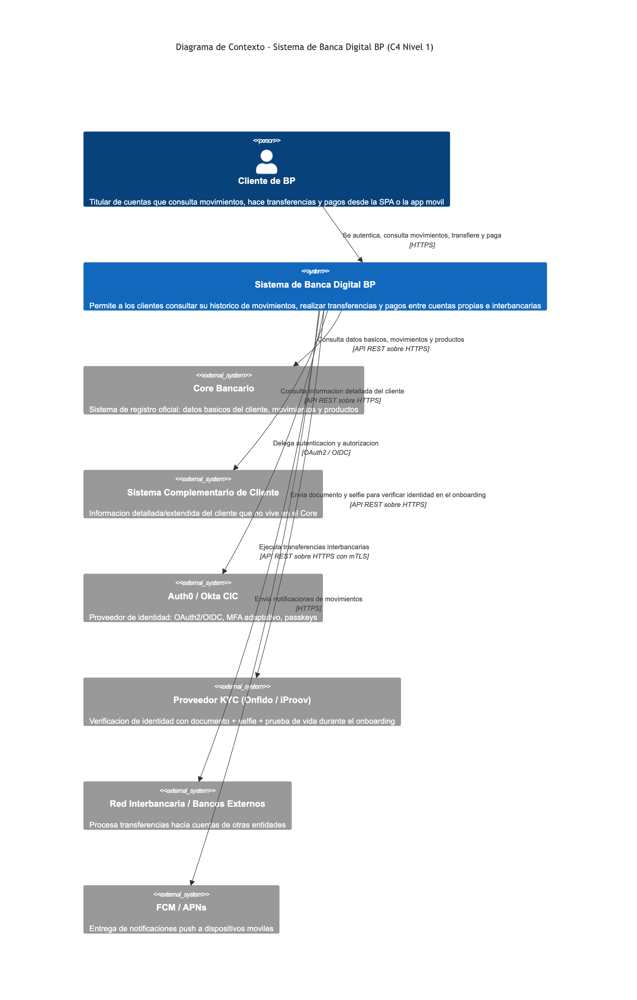
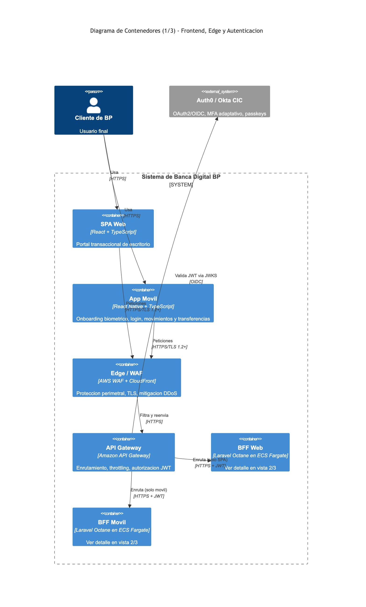
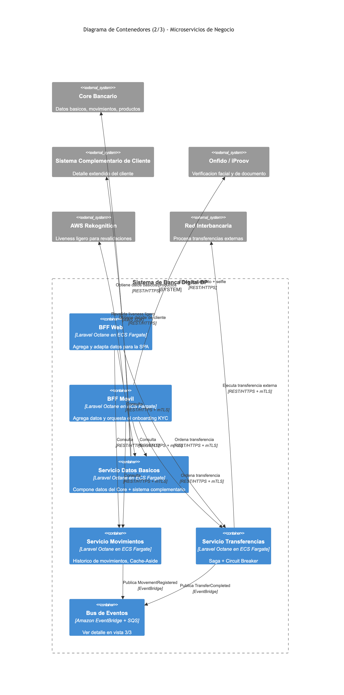
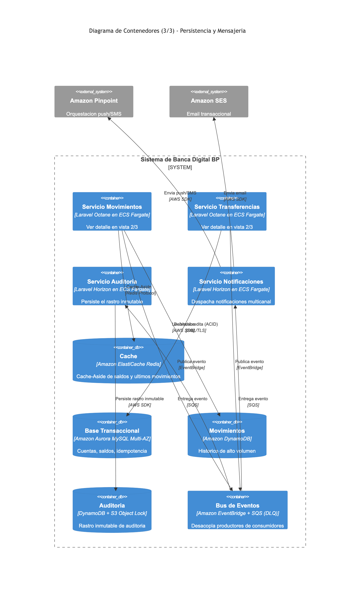
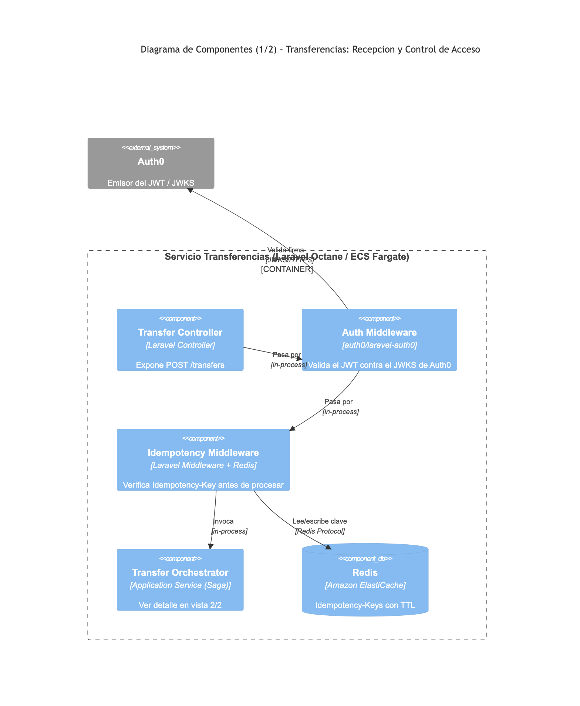
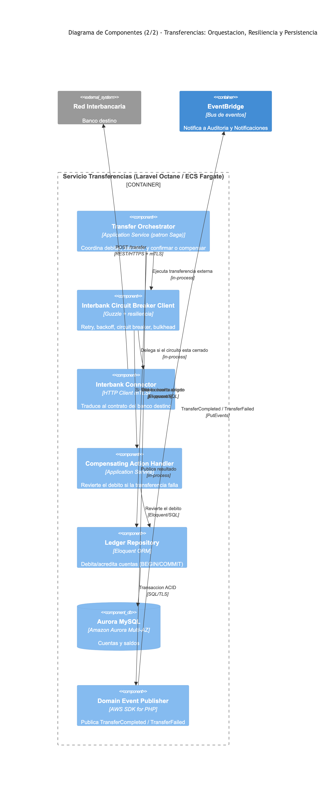
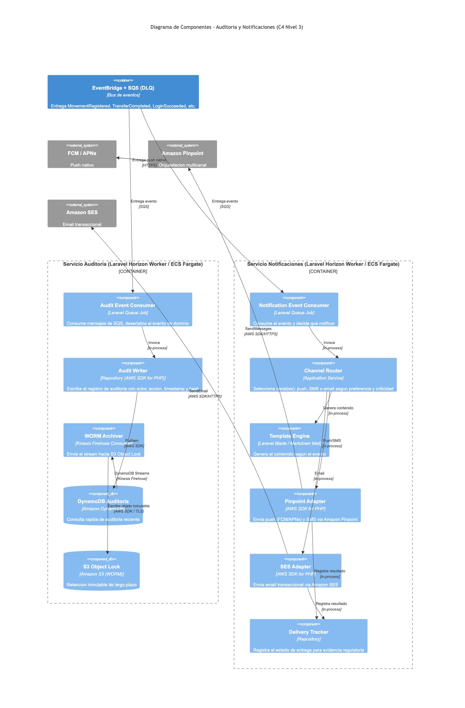
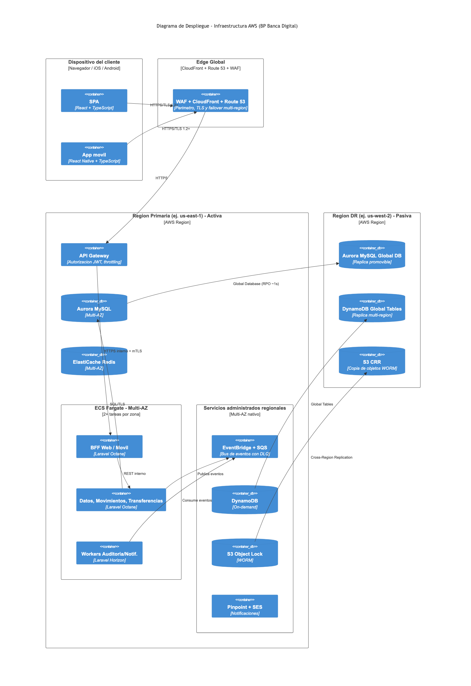
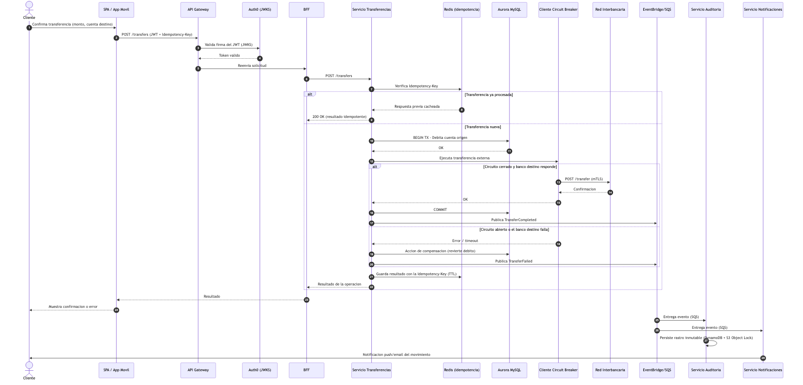
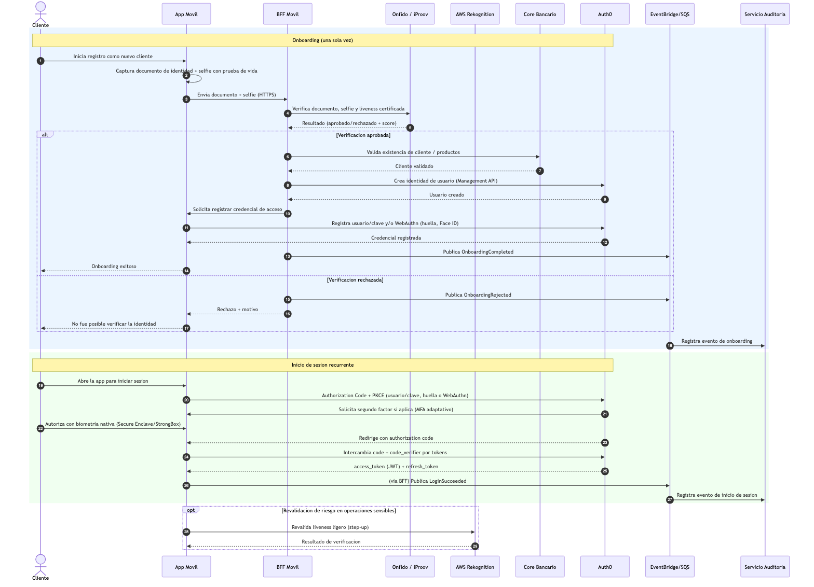

# Arquitectura de Solución — Sistema de Banca Digital BP

**Entidad:** BP
**Tipo de documento:** Diseño de arquitectura de solución (modelo C4)
**Versión:** 1.1
**Fecha:** 2026-07-28
**Clasificación:** Uso interno / confidencial
**Repositorio:** https://github.com/pdfloresjdav/test-devsu
**Autor:** Pedro Flores

---

## Índice

1. [Visión general de la solución](#1-visión-general-de-la-solución)
2. [Alcance y requisitos](#2-alcance-y-requisitos)
3. [Decisiones arquitectónicas](#3-decisiones-arquitectónicas)
4. [Diagrama de Contexto (C4 — Nivel 1)](#4-diagrama-de-contexto-c4--nivel-1)
5. [Diagrama de Contenedores (C4 — Nivel 2)](#5-diagrama-de-contenedores-c4--nivel-2)
6. [Diagrama de Componentes (C4 — Nivel 3)](#6-diagrama-de-componentes-c4--nivel-3)
7. [Diagrama de Despliegue (C4 — Vista de Infraestructura AWS)](#7-diagrama-de-despliegue-c4--vista-de-infraestructura-aws)
8. [Diagramas Dinámicos — Flujos Clave](#8-diagramas-dinámicos--flujos-clave)
9. [Consideraciones transversales](#9-consideraciones-transversales)
10. [Patrones de diseño aplicados](#10-patrones-de-diseño-aplicados)
11. [Glosario](#11-glosario)
12. [Referencias](#12-referencias)

---

## 1. Visión general de la solución

Este documento define la arquitectura de solución para el nuevo sistema de banca digital de **BP**, que permitirá a los clientes consultar su histórico de movimientos, realizar transferencias y pagos entre cuentas propias e interbancarias, desde una aplicación web (SPA) y una aplicación móvil con onboarding biométrico.

La arquitectura se diseñó bajo los siguientes principios rectores:

- **Desacoplada y extensible**: comunicación basada en eventos (EventBridge) y contratos REST versionados, de forma que se puedan agregar nuevos servicios (por ejemplo, un motor de detección de fraude) sin modificar a los productores existentes.
- **Segura por diseño**: autenticación delegada a un proveedor de identidad especializado (Auth0/Okta CIC) usando OAuth 2.0/OIDC con PKCE, cifrado en tránsito y en reposo, y segmentación de datos sensibles conforme a PCI-DSS y normativa de protección de datos.
- **Resiliente**: patrones de Circuit Breaker, Retry con backoff exponencial y Bulkhead en toda integración con sistemas externos (Core bancario, red interbancaria, proveedor KYC).
- **Alta disponibilidad y recuperación ante desastres**: despliegue Multi-AZ para todos los componentes con estado, y estrategia activo-pasivo multi-región para los datos críticos.
- **Costo-consciente**: cómputo en contenedores (ECS Fargate) con autoescalado, evitando sobreaprovisionamiento, y uso de servicios administrados de AWS para reducir carga operativa.

Stack tecnológico principal: **React + TypeScript** (SPA), **React Native + TypeScript** (app móvil), **Laravel (PHP) sobre ECS Fargate** (backend de microservicios), **Auth0/Okta CIC** (identidad OAuth2/OIDC), **Onfido/iProov + AWS Rekognition** (biometría/KYC), **Amazon Aurora MySQL, DynamoDB, ElastiCache Redis** (persistencia), **EventBridge + SQS** (mensajería), **Amazon Pinpoint + SES** (notificaciones).

---

## 2. Alcance y requisitos

| Requisito | Cómo se resuelve |
|---|---|
| Consulta de histórico de movimientos | Servicio Movimientos + Cache-Aside sobre Redis + DynamoDB |
| Transferencias propias e interbancarias | Servicio Transferencias con patrón Saga + Circuit Breaker |
| Datos de cliente desde 2 sistemas (Core + complementario) | Servicio Datos Básicos como agregador/compositor (patrón API Composition) |
| Notificación de movimientos (mínimo 2 canales) | Amazon Pinpoint (push/SMS) + Amazon SES (email), desacoplados vía EventBridge |
| SPA + app móvil multiplataforma | React + TypeScript / React Native + TypeScript |
| OAuth 2.0 con producto configurable | Auth0 (Okta CIC), flujo Authorization Code + PKCE |
| Onboarding con reconocimiento facial | Onfido/iProov (KYC certificado) integrado al flujo de autenticación |
| Auditoría de todas las acciones del cliente | DynamoDB + S3 Object Lock (WORM) |
| Caché/persistencia para clientes frecuentes | Cache-Aside con ElastiCache Redis |
| Capa de integración vía API Gateway | Amazon API Gateway + patrón BFF, 3 servicios iniciales extensibles |
| Normativa financiera, HA, DR, seguridad, monitoreo, auto-healing | Ver [sección 9](#9-consideraciones-transversales) |

---

## 3. Decisiones arquitectónicas

Cada decisión incluye al menos dos justificaciones teóricas y las alternativas evaluadas.

### 3.1 Framework SPA — React + TypeScript

- **Justificación 1:** Ecosistema maduro en banca digital, con soporte robusto de librerías de accesibilidad (WCAG), un requisito frecuente en banca retail.
- **Justificación 2:** Comparte lenguaje y parte de la lógica de negocio con la app móvil (React Native), reduciendo duplicación de código y permitiendo un solo equipo frontend.
- **Alternativas evaluadas:** Angular (más "batteries-included", pero curva de aprendizaje mayor y sin sinergia de código con el móvil elegido); Vue (buena DX, pero ecosistema de librerías bancarias/seguridad menos maduro a nivel enterprise).

### 3.2 Framework móvil multiplataforma — React Native + TypeScript

- **Justificación 1:** Comparte lenguaje (TypeScript) y lógica de negocio con la SPA, permitiendo un solo equipo frontend y consistencia en validaciones/formatos.
- **Justificación 2:** Ecosistema maduro de SDKs nativos críticos para el ejercicio: acceso a Secure Enclave/StrongBox para biometría, cámara para liveness/reconocimiento facial (SDKs oficiales de Onfido/iProov/AWS Amplify), y soporte de actualizaciones OTA para parches de seguridad sin depender de la revisión de tiendas de aplicaciones.
- **Alternativa evaluada — Flutter:** motor de renderizado propio (Skia) que da consistencia visual pixel-perfect entre iOS/Android y mejor rendimiento percibido en animaciones; además, Dart compilado de forma nativa (AOT) reduce la superficie de ingeniería inversa. Se descarta como opción principal por no compartir lenguaje con la SPA (duplicaría lógica de negocio entre Dart y TypeScript), aunque queda documentada como alternativa válida si el equipo no tuviese expertise en JavaScript/TypeScript.

### 3.3 Backend de microservicios — Laravel (PHP) sobre ECS Fargate con Laravel Octane

- **Justificación 1:** Laravel Octane (sobre Swoole) mantiene la aplicación "booteada" en memoria entre solicitudes en lugar de reinicializar el framework en cada request (como ocurre con PHP-FPM tradicional), reduciendo significativamente la latencia p95 — clave para el requisito de baja latencia.
- **Justificación 2:** Laravel provee de fábrica patrones necesarios para este dominio (colas con Horizon, Eloquent ORM, Service Container para inyección de dependencias, Repository pattern idiomático), acelerando el desarrollo sin sacrificar buenas prácticas de arquitectura limpia.
- **Alternativas evaluadas:** Node.js/NestJS (buen desempeño en I/O concurrente y comparte lenguaje con el frontend, pero se descarta porque el equipo de backend definido para este proyecto trabaja en PHP/Laravel); Go (máximo rendimiento y bajo consumo de memoria, pero mayor tiempo de desarrollo y ecosistema de librerías bancarias/KYC menos inmediato que en PHP/Node).

### 3.4 Cómputo — ECS Fargate (síncronos) + Laravel Horizon Workers (asíncronos), en vez de EKS o solo Lambda

- **Justificación 1:** Fargate da contenedores sin gestión de servidores, con menor carga operativa que EKS, y permite control fino de redes privadas (VPC, Service Mesh) necesario para mTLS hacia bancos externos — algo más incómodo de sostener en Lambda por límites de duración/conexión persistente.
- **Justificación 2:** Usar Laravel Horizon (colas sobre SQS) para los consumidores asíncronos (auditoría, notificaciones) mantiene un único lenguaje/runtime en todo el backend, reduciendo la superficie operativa (un solo stack que parchear, versionar y monitorear) en lugar de mezclar PHP con funciones Lambda en otro lenguaje.
- **Alternativas evaluadas:** EKS (máxima flexibilidad y portabilidad, pero mayor complejidad de control plane no justificada sin necesidad real de portabilidad multi-cloud); AWS Lambda para todo (se descarta como pieza central del servicio de Transferencias por límites de duración de ejecución y peor previsibilidad de latencia en operaciones síncronas críticas; se mantiene como opción secundaria para tareas puntuales muy ráfaga, como preprocesar una imagen antes de enviarla al proveedor KYC).

### 3.5 Proveedor OAuth 2.0 — Auth0 (Okta Customer Identity Cloud)

- **Justificación 1:** Es un producto CIAM configurable, certificado, con soporte nativo de WebAuthn/Passkeys y MFA adaptativo basado en riesgo (device fingerprinting, geo-velocity, detección de contraseñas filtradas), cumpliendo el requisito explícito de "no implementar la lógica de autenticación desde cero".
- **Justificación 2:** Actúa como Authorization Server estándar OAuth2/OIDC; el backend Laravel solo necesita validar el JWT emitido (firma y claims) contra el JWKS público de Auth0, sin custodiar contraseñas ni lógica de sesión — separación clara de responsabilidades entre "quién es el usuario" (Auth0) y "qué puede hacer en el sistema" (autorización a nivel de aplicación).
- **Alternativas evaluadas:** Amazon Cognito User Pools (más económico y 100% nativo de AWS, pero sus funcionalidades CIAM avanzadas — passkeys nativos, motor de riesgo — son más limitadas o requieren Lambda triggers a medida); Keycloak autoalojado (control total y sin costo de licencia, pero implica operar y asegurar el propio Identity Provider, lo cual contradice el requisito de usar un producto configurable y añade carga operativa en un dominio tan sensible como la autenticación).

### 3.6 Flujo OAuth 2.0 — Authorization Code + PKCE, con Refresh Token Rotation y DPoP

- **Justificación 1:** Es el flujo recomendado por OAuth 2.1 / BCP (RFC 8252 y RFC 7636) para clientes públicos como una SPA o una app móvil, que no pueden custodiar un client secret de forma segura; PKCE mitiga la interceptación del authorization code.
- **Justificación 2:** DPoP (Demonstrating Proof-of-Possession) ata el token de acceso a una clave criptográfica del dispositivo, evitando que un token robado (por ejemplo, vía XSS o filtración de logs) pueda reutilizarse desde otro origen — control adicional relevante para transferencias de alto valor.
- **Autenticación reforzada (step-up):** para transferencias sobre un umbral definido, se solicita un `acr_values` más alto (reautenticación biométrica), replicando el concepto de Autenticación Fuerte de Cliente (SCA) usado en normativas de pagos.
- **Alternativas evaluadas:** Implicit Flow (obsoleto, expone tokens en el fragmento de la URL y sin renovación segura — eliminado en OAuth 2.1); Resource Owner Password Credentials (expone las credenciales directamente a la aplicación cliente, incompatible con MFA/biometría delegada); Client Credentials (aplica solo a comunicación máquina-a-máquina, no a usuarios finales).

### 3.7 Onboarding biométrico y verificación de identidad — Onfido/iProov (KYC) + AWS Rekognition (revalidaciones) + WebAuthn/FIDO2 (login recurrente)

- **Justificación 1:** Onfido/iProov cuentan con certificación de detección de vida (liveness) de nivel iBeta, estándar de facto exigido en KYC bancario para prevenir suplantación con foto, video o deepfake — un nivel de garantía forense que Rekognition por sí solo no certifica de la misma manera para el emparejamiento documento-de-identidad-contra-selfie.
- **Justificación 2:** Usar un especialista KYC para el onboarding (evento único, bajo volumen, alto riesgo) y AWS Rekognition Face Liveness para revalidaciones posteriores de menor riesgo (más económico y ya integrado en el ecosistema AWS) optimiza el costo sin sacrificar seguridad donde más importa.
- **Justificación login recurrente:** WebAuthn/FIDO2 junto con biometría nativa (Face ID / BiometricPrompt) atada al Secure Enclave/StrongBox del dispositivo evita transmitir datos biométricos al servidor en cada inicio de sesión — solo se valida una aserción criptográfica, reduciendo la exposición de datos sensibles y el alcance regulatorio de protección de datos personales.
- **Alternativas evaluadas:** Jumio (comparable a Onfido/iProov, opción B válida); usar únicamente AWS Rekognition para todo el flujo de onboarding (más económico, pero con riesgo regulatorio si un auditor exige una certificación de liveness específica para procesos KYC/AML).

### 3.8 Patrón de caché/persistencia para clientes frecuentes — Cache-Aside con Amazon ElastiCache (Redis)

- **Justificación 1:** El patrón Cache-Aside da control explícito sobre qué se cachea (saldo, últimos movimientos, datos de perfil) y sobre su invalidación (TTL corto + invalidación activa al registrarse un nuevo movimiento vía evento de dominio), evitando servir datos financieros obsoletos — riesgo inaceptable con un patrón Write-Behind.
- **Justificación 2:** Redis soporta estructuras de datos (sorted sets, hashes) ideales para representar "los últimos N movimientos por cuenta" y permite despliegue Multi-AZ con failover automático, cumpliendo alta disponibilidad sin lógica adicional en la aplicación.
- **Alternativas evaluadas:** DynamoDB Accelerator — DAX (patrón Read-Through más transparente para la aplicación, buena opción B, pero acoplado únicamente a DynamoDB); Write-Through (garantiza mayor consistencia, pero añade latencia a cada escritura, penalizando justamente las transferencias, que ya son sensibles a la latencia).

### 3.9 Base de datos de auditoría — DynamoDB + S3 Object Lock (WORM), con OpenSearch para consulta

- **Justificación 1:** Se requiere alta cardinalidad de escritura (una entrada por cada acción del cliente, en cada sesión), patrón de acceso para el que DynamoDB está diseñado, particionando por `customerId#timestamp`.
- **Justificación 2:** S3 Object Lock en modo *Compliance* provee inmutabilidad real (ni siquiera el usuario root de la cuenta puede eliminar el objeto antes de vencer el periodo de retención), satisfaciendo el requisito regulatorio de no repudio y de retención de largo plazo (típicamente 5 a 10 años en banca) sin depender de un servicio de tipo ledger.
- **Nota relevante:** Amazon QLDB —el servicio "ledger" nativo de AWS, la opción más obvia para auditoría inmutable— **dejó de estar disponible para clientes nuevos desde julio de 2025**, por lo que no se recomienda para un diseño nuevo. El patrón DynamoDB Streams → Kinesis Data Firehose → S3 (Object Lock) reproduce garantías equivalentes de inmutabilidad sin depender de un servicio descontinuado.
- **Alternativas evaluadas:** Aurora MySQL con tabla append-only y triggers (más simple relacionalmente, pero la inmutabilidad solo existe a nivel de aplicación, no de infraestructura, y es más débil ante un actor con acceso de administrador de base de datos).

### 3.10 Persistencia core transaccional — Amazon Aurora MySQL (Multi-AZ) + DynamoDB (movimientos)

- **Justificación 1:** Las transferencias requieren ACID real (débito y crédito atómicos); Aurora MySQL ofrece replicación síncrona Multi-AZ y failover en menos de 30 segundos, y es el driver más idiomático de Eloquent/Laravel.
- **Justificación 2:** El histórico de movimientos tiene un patrón de acceso simple (por cuenta y rango de fecha) con alto volumen de lectura/escritura; DynamoDB escala horizontalmente sin gestión manual de particionado, y sus Streams alimentan directamente el pipeline de auditoría y de invalidación de caché.
- **Acceso desde Laravel:** Aurora se accede vía Eloquent ORM; DynamoDB se accede vía `aws/aws-sdk-php` encapsulado detrás de un patrón Repository (Eloquent no soporta DynamoDB de forma nativa), manteniendo la misma abstracción de acceso a datos que el resto de la aplicación.
- **Alternativas evaluadas:** Todo en Aurora (más simple de operar, pero el histórico de movimientos crecería a un tamaño que degrada el rendimiento de un motor relacional sin sharding adicional); todo en DynamoDB (elimina las transacciones multi-fila necesarias para garantizar consistencia de saldos en transferencias).

### 3.11 Capa de integración — API Gateway + patrón BFF (uno por canal)

- **Justificación 1:** Un BFF por canal (Web y Móvil) permite payloads optimizados para cada cliente (la app móvil necesita menos datos por consumo de batería/ancho de banda que la SPA) sin acoplar el contrato de los microservicios a un cliente específico.
- **Justificación 2:** API Gateway centraliza throttling, autorización (JWT Authorizer contra el JWKS de Auth0) y observabilidad de entrada, actuando como punto único de control de seguridad perimetral antes de llegar a los microservicios internos.
- **Alternativas evaluadas:** Un solo BFF genérico para ambos frontends (menor esfuerzo inicial, pero fuerza sobre-carga de datos en móvil o sub-carga en SPA, y acopla los releases de ambos canales); exponer los microservicios directamente sin BFF (se descarta porque rompe el encapsulamiento del dominio y dificulta el versionado independiente por canal).

### 3.12 Notificaciones (mínimo 2 canales) — Amazon Pinpoint (push/SMS) + Amazon SES (email)

- **Justificación 1:** Pinpoint da trazabilidad de entrega —crítico porque la norma exige poder demostrar que el cliente fue notificado— y gestiona consentimiento/opt-out, un requisito de protección de datos personales.
- **Justificación 2:** Separar el canal inmediato (push vía Pinpoint/FCM/APNs, para alertas de movimiento en tiempo real) del canal de respaldo (email vía SES, como constancia documental) da redundancia real ante la falla de un canal, más allá de una simple duplicación.
- **Alternativas evaluadas:** Twilio (excelente para SMS/WhatsApp internacional, pero implica otro proveedor externo adicional que gestionar y asegurar, con mayor costo); Firebase Cloud Messaging en solitario (cubre push, pero no resuelve por sí mismo el canal de email/SMS).

### 3.13 Mensajería/orquestación de eventos — Amazon EventBridge + SQS (con DLQ)

- **Justificación 1:** EventBridge permite que nuevos servicios (por ejemplo, un futuro motor de scoring de fraude) se suscriban a eventos ya existentes (`TransferCompleted`) sin modificar al productor original, satisfaciendo directamente el requisito de extensibilidad futura.
- **Justificación 2:** Tener una cola SQS por consumidor da *backpressure* y aislamiento de reintentos (si el servicio de Auditoría se degrada, el envío de notificaciones no se bloquea), aplicando los patrones Competing Consumers y Bulkhead.
- **Alternativas evaluadas:** SNS + SQS en modo "fan-out" puro (más simple y económico, y válido, pero sin filtrado de contenido ni schema registry, lo que dificulta la extensibilidad a mediano plazo); Kafka/Amazon MSK (más potente para throughput muy alto y replay de eventos de larga duración, pero sobre-ingeniería operativa para el volumen inicial descrito en el ejercicio).

### 3.14 Identidad y acceso a recursos AWS desde el backend — IAM Roles por tarea de ECS

- **Justificación 1:** Como el backend es una aplicación de servidor tradicional (Laravel) y no un cliente público que necesite credenciales AWS temporales federadas, cada microservicio recibe un **ECS Task IAM Role** de mínimo privilegio (por ejemplo, el servicio de Auditoría solo puede escribir en su tabla DynamoDB específica), evitando sobre-privilegios.
- **Justificación 2:** Este patrón evita introducir un salto adicional de federación (Cognito Identity Pools) que no aporta valor cuando el consumidor de las credenciales es un servicio de backend de confianza, simplificando la cadena de autorización: Auth0 (identidad de usuario) → API Gateway (validación JWT) → IAM Role de la tarea (acceso a recursos AWS).
- **Alternativas evaluadas:** Cognito Identity Pools con token exchange (patrón más apropiado cuando un cliente público como la SPA necesita hablar directamente con un servicio de AWS, por ejemplo S3, sin pasar por el backend; no aplica aquí porque todo acceso a datos pasa por los microservicios).

---

## 4. Diagrama de Contexto (C4 — Nivel 1)

**Audiencia:** no técnica (negocio, cumplimiento, dirección).

**Lectura del diagrama:** el cliente interactúa únicamente con el "Sistema de Banca Digital BP". Ese sistema, a su vez, se apoya en seis sistemas externos: el Core Bancario (fuente oficial de datos, movimientos y productos), un sistema complementario que enriquece el perfil del cliente, un proveedor de identidad (Auth0/Okta) que gestiona el login y la autenticación fuerte, un proveedor especializado de verificación de identidad (Onfido/iProov) usado durante el alta de un nuevo cliente, la red interbancaria por donde salen las transferencias hacia otras entidades, y los servicios de notificación push del propio teléfono (FCM/APNs).

---

## 5. Diagrama de Contenedores (C4 — Nivel 2)

**Audiencia:** técnica (arquitectura, desarrollo, operaciones).

Por la cantidad de contenedores del sistema (21 en total), se documenta en **3 vistas complementarias** en vez de un único diagrama saturado — práctica habitual en C4 cuando un diagrama de contenedores crece demasiado para leerse de un vistazo. Las tres vistas comparten elementos de borde para mantener el contexto entre sí.

### 5.1 Vista 1/3 — Frontend, Edge y Autenticación

**Lectura del diagrama:** el cliente accede vía SPA (React) o app móvil (React Native), ambas pasando por WAF/CloudFront y Amazon API Gateway, que valida el JWT contra el JWKS de Auth0 antes de enrutar hacia el BFF correspondiente a cada canal.

### 5.2 Vista 2/3 — Microservicios de Negocio

**Lectura del diagrama:** ambos BFF consultan los tres microservicios de negocio (Datos Básicos, Movimientos, Transferencias). Datos Básicos compone información del Core bancario y del sistema complementario; el BFF Móvil además orquesta el onboarding contra el proveedor KYC y AWS Rekognition; Transferencias llama a la red interbancaria y ambos servicios publican eventos de dominio al bus.

### 5.3 Vista 3/3 — Persistencia y Mensajería

**Lectura del diagrama:** Movimientos usa Cache-Aside sobre Redis y persiste en DynamoDB; Transferencias persiste en Aurora MySQL. Ambos publican al bus de eventos (EventBridge + SQS), que desacopla la escritura hacia Auditoría (DynamoDB + S3 Object Lock) y el despacho de Notificaciones (Pinpoint + SES) de los servicios que originan el evento.

---

## 6. Diagrama de Componentes (C4 — Nivel 3)

**Audiencia:** técnica (desarrollo de detalle).

Se detallan los dos contenedores de mayor complejidad interna: el **Servicio de Transferencias** (por concentrar el patrón Saga, idempotencia y Circuit Breaker — dividido en 2 vistas por su tamaño) y el conjunto **Auditoría + Notificaciones** (por concentrar el pipeline de eventos y el requisito de inmutabilidad regulatoria).

### 6.1 Componentes — Transferencias: Recepción y Control de Acceso (1/2)

**Lectura del diagrama:** cada request pasa primero por el middleware de autenticación (valida el JWT contra Auth0) y luego por el middleware de idempotencia (evita procesar dos veces la misma transferencia si el cliente reintenta por timeout) antes de entrar al orquestador.

### 6.2 Componentes — Transferencias: Orquestación, Resiliencia y Persistencia (2/2)

**Lectura del diagrama:** el orquestador aplica el patrón Saga: debita en Aurora, intenta la transferencia externa a través de un cliente con Circuit Breaker, y si falla, ejecuta una acción de compensación que revierte el débito. Al finalizar (con éxito o falla), publica un evento de dominio en EventBridge.

### 6.3 Componentes — Auditoría y Notificaciones

**Lectura del diagrama:** ambos servicios son consumidores independientes del mismo bus de eventos (patrón Pub/Sub con Competing Consumers). Auditoría escribe primero en DynamoDB para consulta rápida y luego archiva el mismo evento en S3 con Object Lock para retención inmutable de largo plazo. Notificaciones decide el canal según el tipo de evento y la preferencia del cliente, y registra el resultado de la entrega como evidencia para cumplimiento normativo.

---

## 7. Diagrama de Despliegue (C4 — Vista de Infraestructura AWS)

**Audiencia:** técnica (infraestructura, DevOps, seguridad).

**Lectura del diagrama:** el tráfico del cliente entra por Route 53 y CloudFront/WAF, llega a API Gateway y de ahí a una VPC privada con dos zonas de disponibilidad (AZ-A y AZ-B), cada una con su propio clúster de tareas ECS Fargate y su réplica de Aurora/Redis. Los servicios administrados regionales (EventBridge/SQS, DynamoDB, S3, Pinpoint/SES) son nativamente Multi-AZ y no requieren gestión de zonas por parte del equipo. Una región secundaria pasiva (DR) mantiene réplicas continuas de Aurora (Global Database), DynamoDB (Global Tables) y S3 (Cross-Region Replication), lista para recibir tráfico si Route 53 detecta la caída de la región primaria.

---

## 8. Diagramas Dinámicos — Flujos Clave

Los diagramas dinámicos del modelo C4 muestran, para un escenario de ejecución concreto, cómo colaboran en tiempo de ejecución los elementos ya definidos en los diagramas estáticos (contenedores/componentes). Se documentan los dos flujos más críticos del ejercicio: una transferencia interbancaria y el onboarding biométrico con su primer inicio de sesión.

### 8.1 Flujo de transferencia interbancaria

**Lectura del diagrama:** ilustra en secuencia el patrón Idempotency Key (evita doble cobro ante reintentos), el patrón Saga con su paso de compensación (si el banco destino falla, se revierte el débito) y el patrón Pub/Sub posterior (Auditoría y Notificaciones se enteran del resultado sin que el Servicio de Transferencias sepa que existen).

### 8.2 Flujo de onboarding biométrico y autenticación

**Lectura del diagrama:** el primer bloque cubre el alta del cliente (documento + selfie con prueba de vida verificados por el proveedor KYC, creación de la identidad en Auth0 y registro de la credencial de acceso). El segundo bloque cubre el inicio de sesión recurrente ya con Authorization Code + PKCE y biometría nativa del dispositivo, sin volver a pasar por el proveedor KYC.

---

## 9. Consideraciones transversales

### 9.1 Normativa y cumplimiento

- **Protección de datos personales:** minimización de datos biométricos — la imagen facial cruda no se almacena más allá del proceso de onboarding en el proveedor KYC; el sistema solo conserva el resultado de la verificación (aprobado/rechazado + score). Cifrado de PII en reposo (KMS) y en tránsito (TLS 1.2+). Toda lectura de datos personales queda registrada en la base de auditoría (sección 3.9).
- **PCI-DSS:** si el sistema llega a manejar datos de tarjeta, se recomienda tokenización (AWS Payment Cryptography o el vault de un procesador de pagos) para reducir el alcance de la certificación PCI-DSS a la mínima porción posible del sistema, en vez de certificar el sistema completo.
- **No repudio / trazabilidad:** la combinación DynamoDB + S3 Object Lock (sección 3.9) garantiza que el rastro de auditoría no pueda alterarse retroactivamente, un requisito habitual en normativa financiera local y en auditorías externas.
- **Retención:** políticas de ciclo de vida en S3 (Object Lock con retención configurable, típicamente 5-10 años según la regulación local aplicable a BP).

### 9.2 Alta disponibilidad (HA)

- Todos los componentes con estado (Aurora, ElastiCache, colas) desplegados en **Multi-AZ**.
- Microservicios en ECS Fargate con un mínimo de 2 tareas por Availability Zone, detrás de un Application Load Balancer con health checks activos.
- API Gateway y CloudFront distribuidos globalmente por diseño (servicios administrados con SLA de alta disponibilidad nativo).

### 9.3 Recuperación ante desastres (DR)

- Estrategia **activo-pasivo multi-región**: Aurora Global Database (RPO cercano a 1 segundo) y DynamoDB Global Tables para replicación entre regiones.
- Route 53 con *failover routing* y health checks para redirigir tráfico a la región secundaria ante una falla regional.
- Objetivos de referencia (a validar con el área de continuidad de negocio de BP): RTO < 4 horas y RPO < 15 minutos para los servicios core (Transferencias, Movimientos).

### 9.4 Seguridad

- **WAF + Shield Advanced** en el borde (CloudFront/API Gateway) contra OWASP Top 10 y ataques DDoS.
- **KMS** para cifrado en reposo con llaves separadas por dominio de dato (segmentación relevante para PCI-DSS); **Secrets Manager** con rotación automática de credenciales de servicio.
- **mTLS** entre microservicios internos — ningún tráfico interno viaja en texto plano, requisito habitual en auditorías PCI-DSS.
- **IAM Roles de mínimo privilegio** por tarea de ECS (sección 3.14), evitando credenciales compartidas o sobre-privilegiadas.

### 9.5 Monitoreo y excelencia operativa

- **Amazon CloudWatch** para métricas, logs centralizados y alarmas.
- **AWS X-Ray** para tracing distribuido — esencial para diferenciar si una lentitud proviene del propio sistema BP o de una dependencia externa (Core bancario, red interbancaria, proveedor KYC), dato clave para gestionar SLAs y decidir cuándo debe abrirse un Circuit Breaker.
- **CloudWatch Synthetics** (canarios) simulando flujos críticos (login, consulta de movimientos, transferencia) de forma continua.
- **GuardDuty y Security Hub** para postura de seguridad continua y detección de amenazas.

### 9.6 Auto-healing

- ECS Fargate reemplaza automáticamente tareas que fallan los health checks del Load Balancer, sin intervención manual.
- Auto Scaling basado en métricas de CloudWatch (CPU, latencia, profundidad de las colas SQS) ajusta la capacidad de cada microservicio de forma independiente.

### 9.7 Manejo de costos en AWS

- **Fargate** evita pagar por capacidad ociosa de servidores EC2 que habría que gestionar manualmente.
- Los consumidores asíncronos (Auditoría, Notificaciones) escalan según profundidad de cola, evitando sobreaprovisionar cómputo para cargas que son, por naturaleza, intermitentes.
- Uso de servicios administrados (RDS/Aurora, ElastiCache, EventBridge, Pinpoint, SES) en lugar de autogestionar dicha infraestructura, trasladando el costo operativo de mantenimiento hacia AWS a cambio de una tarifa por uso — decisión razonable dado que el enunciado confirma presupuesto disponible y prioriza baja latencia y confiabilidad sobre minimizar el costo de infraestructura.

---

## 10. Patrones de diseño aplicados

| Patrón | Dónde se aplica | Por qué |
|---|---|---|
| **API Gateway** | Entrada única del sistema (Amazon API Gateway) | Centraliza autenticación, throttling y observabilidad de entrada |
| **Backend for Frontend (BFF)** | BFF Web y BFF Móvil | Evita sobre/sub-carga de datos por canal y desacopla releases de frontend |
| **Circuit Breaker** | Cliente de conexión a la red interbancaria (Servicio Transferencias) | Evita cascadas de fallos cuando un sistema externo se degrada |
| **Retry con backoff exponencial + jitter** | Todas las integraciones externas (Core, complementario, interbancaria, KYC) | Absorbe fallos transitorios de red sin sobrecargar al sistema destino |
| **Bulkhead** | Colas SQS independientes por consumidor (Auditoría, Notificaciones) | Aísla fallos: un consumidor lento no bloquea a los demás |
| **Saga (orquestada)** | Servicio Transferencias | Coordina débito, transferencia externa y compensación como una transacción distribuida |
| **Idempotency Key** | Servicio Transferencias | Evita doble procesamiento ante reintentos de red del cliente |
| **Cache-Aside** | Servicio Movimientos + ElastiCache Redis | Da control explícito sobre qué se cachea y cuándo se invalida, evitando datos financieros obsoletos |
| **Pub/Sub (Competing Consumers)** | EventBridge + SQS hacia Auditoría y Notificaciones | Desacopla productores de consumidores, extensible a futuros servicios |
| **CQRS (ligero)** | Lecturas vía caché/DynamoDB frente a escrituras vía Aurora | Separa el modelo de lectura (rápido, eventualmente consistente) del modelo de escritura (consistente, transaccional) |
| **Repository** | Acceso a DynamoDB desde Laravel (`aws/aws-sdk-php`) | Abstrae el acceso a un almacén que Eloquent no soporta nativamente, manteniendo el dominio desacoplado de la infraestructura |
| **API Composition** | Servicio Datos Básicos | Compone la respuesta del Core bancario y del sistema complementario de cliente en un único contrato |
| **Token Exchange / Resource Server** | API Gateway (JWT Authorizer) + Laravel (validación JWKS) | Delega la autenticación a Auth0 sin implementar lógica de auth propia |

---

## 11. Glosario

- **BFF (Backend for Frontend):** capa de backend dedicada a un canal de frontend específico.
- **PKCE (Proof Key for Code Exchange):** extensión de OAuth2 que protege el flujo de Authorization Code en clientes públicos.
- **DPoP (Demonstrating Proof-of-Possession):** mecanismo que ata un token de acceso a una clave criptográfica del cliente.
- **WORM (Write Once, Read Many):** modelo de almacenamiento donde los datos no pueden modificarse ni eliminarse tras escribirse.
- **Saga:** patrón para coordinar transacciones distribuidas mediante una secuencia de pasos locales y compensaciones.
- **Circuit Breaker:** patrón que detiene temporalmente las llamadas a un servicio que está fallando, para evitar fallos en cascada.
- **RTO/RPO:** Recovery Time Objective / Recovery Point Objective, métricas de continuidad de negocio ante desastres.
- **KYC (Know Your Customer):** proceso regulatorio de verificación de identidad del cliente.

---

## 12. Referencias

- Repositorio del proyecto (código fuente de los diagramas, documento y PDF): https://github.com/pdfloresjdav/test-devsu
- OAuth 2.0 Security Best Current Practice (RFC 9700 / borrador de OAuth 2.1).
- RFC 7636 — Proof Key for Code Exchange (PKCE).
- RFC 8252 — OAuth 2.0 for Native Apps.
- Documentación oficial de AWS: API Gateway, ECS Fargate, Aurora, DynamoDB, ElastiCache, EventBridge, Pinpoint, SES, S3 Object Lock, WAF, KMS, GuardDuty, X-Ray.
- Documentación oficial de Auth0 / Okta Customer Identity Cloud.
- Documentación oficial de Onfido / iProov (verificación de identidad y liveness).
- The C4 model for visualising software architecture — https://c4model.com
